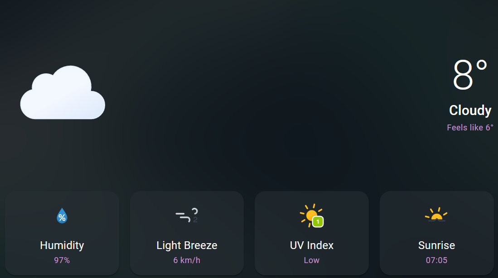

# Ambient (Weather Forecast)

[Ambient](https://stassribnyi.github.io/magic-app-redux) is a simple and user-friendly tool to get the weather information for any location. It can show the current, hourly and daily forecast, as well as a chart with atmospheric conditions.

## Features

- **Current Forecast**: shows the current temperature with a short description, how it feels like, humidity percentage, wind speed by Beaufort scale, UV index by scale and sunrise/sunset time. You can see an example of this feature in the screenshot below:



- **Hourly Forecast**: shows the precipitation probability, temperature, and time for the next 24 hours. You can see an example of this feature in the screenshot below:


- **Daily Forecast**: shows the same information as the hourly forecast, but for the next 10 days. You can see an example of this feature in the screenshot below:


- **Atmospheric Conditions Chart**: This feature shows a separate chart with cloud cover, relative humidity and precipitation probability to visualize the atmospheric conditions hourly for 10 days. You can see an example of this feature in the screenshot below:


## How to use

To use Ambient, you need to change location to yours, you can do so via menu in the top left corner. The webpage will then display the current, hourly and daily forecast, as well as the chart, for selected location. You can also change the units of measurement for the temperature and wind speed by clicking on the toggle at the top right corner of the webpage.


## Credits

This webpage was created by Stas Sribnyi using React, Typescript, MUI, Vite and Passion! There are more to it, for more information please check package.json file. The weather data was obtained from openmeteo.com. The icons and images were taken from @bybas/meteocons. The chart was created using MUI-Charts-X.

## Built with React, Typescript, MUI, Vite and Passion!

## TODO: How to run locally:

This template provides a minimal setup to get React working in Vite with HMR and some ESLint rules.

Currently, two official plugins are available:

- [@vitejs/plugin-react](https://github.com/vitejs/vite-plugin-react/blob/main/packages/plugin-react/README.md) uses [Babel](https://babeljs.io/) for Fast Refresh
- [@vitejs/plugin-react-swc](https://github.com/vitejs/vite-plugin-react-swc) uses [SWC](https://swc.rs/) for Fast Refresh

## Expanding the ESLint configuration

If you are developing a production application, we recommend updating the configuration to enable type aware lint rules:

- Configure the top-level `parserOptions` property like this:

```js
   parserOptions: {
    ecmaVersion: 'latest',
    sourceType: 'module',
    project: ['./tsconfig.json', './tsconfig.node.json'],
    tsconfigRootDir: __dirname,
   },
```

- Replace `plugin:@typescript-eslint/recommended` to `plugin:@typescript-eslint/recommended-type-checked` or `plugin:@typescript-eslint/strict-type-checked`
- Optionally add `plugin:@typescript-eslint/stylistic-type-checked`
- Install [eslint-plugin-react](https://github.com/jsx-eslint/eslint-plugin-react) and add `plugin:react/recommended` & `plugin:react/jsx-runtime` to the `extends` list
